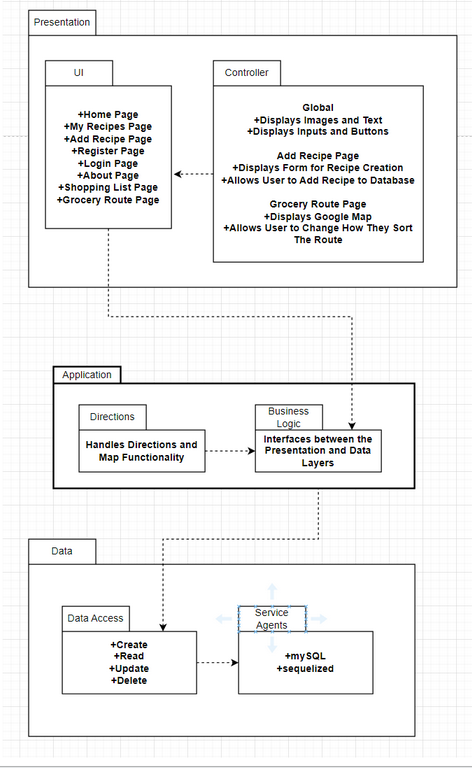
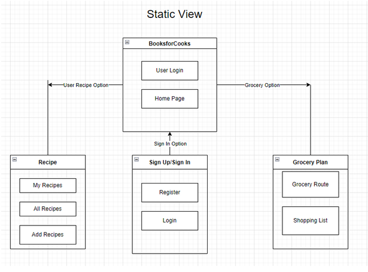

<h1>BOOKS 4 COOKS Project Design Document</h1>

<h2>ITCS 4155</h2>

<h2>Team 6</h2>

    Caesar, Lee
    Chassin, Phoenix
    Garcia, Jake
    Hall, Henry
    Jordan, Mason
    Reed, Tyrone

**April 13, 2023**

<h1>Project Overview</h1>

For many home cooks it is difficult to find a website that is able to supply them with all the features they desire in a cookbook. _Books 4 Cooks _aims to offer a single website where a home cook can access recipes and plan their grocery shopping for the week. Currently, there are no websites that provide home cooks with an all-in-one package of recipe creation, recipe viewing, and grocery trip planning. Our website will allow users to upload and access their recipes on a per-account basis, allowing them to keep track of their recipes on multiple devices. Additionally, _Books 4 Cooks_ will provide a trip planner that creates a grocery plan to do the shopping for the ingredients you need seamlessly.

<h2>Architectural Overview</h2>

_Books 4 Cooks _is a website designed for desktop and laptop viewing. As the main functionality of the website is focused on creating and viewing recipes, we felt that a large-screen viewing experience would be best for usability. Some users would like to be able to use the website on mobile devices in order to view their recipes on a smaller screen in the kitchen. We felt that keeping our focus on large screen viewing for both desktop and laptop allows for our major functionality to be better structured and allows for users to make use of the website in the kitchen if they desire. In order to implement the website, we used an MVC software architectural pattern. We chose this system in order to maintain the expansive website that has a front end, a database-based back end, with additional programs that need to be executed on different pages of the website. Our model is implemented using MySQL and is interfaced with the code using equalization. Our view is implemented using ejs in order to display a consistent HTML-based webpage to the user. Our controller is implemented using Node.js in order to render the views and change the models as necessary. Our server is hosted on an AWS server using elastic beanstalk and allows for a consistent version of the website to be hosted for all users to access.

<h2>Subsystem Architecture</h2>

There are three subsystem layers within our application: presentation, application, and data. The subsystems in our web application are designed to handle different aspects of the platform, including user interface, data storage, data retrieval, and integration with external services.

Presentation:

User Interface: The user interface of BookForCooks is developed using EJS pages. EJS provides a way to create dynamic web pages by embedding JavaScript code within HTML templates. This allows for easy customization and interactivity, resulting in a responsive interface for users.

<h2>Application:</h2>

Google Directions API: BookForCooks integrates with the Google Directions API. This external service provides users with accurate and easy-to-follow directions to nearby grocery stores or other relevant locations. By incorporating this API, the platform adds value to users by simplifying their shopping and meal planning process.

Business Logic: Our application’s business logic is handled via node.js interfacing with the presentation and data layers of the system.

<h2>Data:</h2>

Data Storage: The platform utilizes Sequelize, an Object-Relational Mapping (ORM) library for Node.js, to manage and interact with the data stored in an Amazon RDS (Relational Database Service) instance.

Data Retrieval: BookForCooks retrieves data through POST requests made by the Node.js web application. This enables the application to handle user interactions, such as searching for recipes, adding new recipes, or updating existing ones. The use of POST requests ensures that data is securely transmitted and easily processed by the server.

<h1>Deployment Architecture </h1>

Our web app is built using Node.js, a JavaScript runtime environment. The application is hosted on AWS Elastic Beanstalk, an all-in-one service that simplifies the deployment, scaling, and maintenance of web applications. Elastic Beanstalk integrates with Amazon EC2 instances for computing resources and Amazon RDS for managing databases, ensuring flexibility.

To serve content quickly and with low latency to users worldwide, the primary domain, bookforcooks.com, utilizes Cloudflare as its content delivery network (CDN). This not only accelerates content delivery but also adds an extra layer of security through its built-in DDoS protection and SSL encryption. With a certificate from AWS certificate manager.

In addition, a Continuous Integration and Continuous Deployment (CI/CD) pipeline has been implemented to streamline the development process. This pipeline facilitates the automatic deployment of updates and changes to the master branch as they are pushed. This ensures that the platform remains current with the latest features and enhancements. The client connects to the Books 4 Cooks server using an HTTPS connection via their web browser. Elastic Beanstalk hosts the server consisting of an MVC model. It is connected to the database server through sequelized.

<h1>Persistent Data Storage</h1>

We will store our data in a  mySQL relational database implemented using sequelized. The data will be collected by one of two forms that post the information into the associated tables upon submission. As there will be user accounts, one form will be used to take the information from a registration page and store it in a users table. This table will contain the user's name, login information, and home location. The other tables will contain information pertaining to recipes that users can upload to their account. A form will be used to gather the information for a recipe and, when submitted, will add it to a set of related tables. There is a parent table that stores information about a recipe, an instructions tables that stores all the instructions for a given recipe, a recipe ingredients table that acts as a parent table for each ingredient in a recipe, a measurement units table that stores the units for each ingredient, an ingredients table that stores the information about each particular ingredient, and a measurement table that stores the information concerning how much of a particular ingredient is needed in a recipe.

**Global control Flow  **

_Books 4 Cooks _is a procedure-driven system that executes in a linear fashion. Although there are multiple pages that a user can visit in any order that they wish, any functionality that is carried out will always occur in the same steps. The model was chosen to give users the freedom to visit different pages of the website at their own pace, while still providing consistent functionality for the main features of the system. A user will not be able to access any recipes until they have uploaded a recipe to their account. Once a user has a recipe in their account they can view the recipes and add any ingredients to their shopping list. Once their shopping list has items they can use the maps functionality in order to display their grocery shopping route. The system does not have any timer-controlled actions, it is an event-response type system. The system does not use multiple threads in its execution. Any functionality that requires information in order to run must receive the information in full before execution can begin.

**Detailed System Design **

Our system is implemented using the MVC architecture and implements node.js as the controller, ejs as the view, and mySQL as the model. The view portion implemented by ejs displays all the content of the website to the user. The model implemented by mySQL is the basis of the relational tables that hold all the data needed for the website to function. The controller implemented by node.js interfaces between the model and the view in order to get the data needed for displaying the functions to the user. It is a CRUD system so it can create, read, update, and delete data from the system. Additionally we use Google’s Maps API in order to implement the shopping trip functionality.

**Static View **

A user can access the main homepage and login page after first logging into the Books 4 Cooks website. They can either register or sign in on the sign in page. The user can login to the website in order to gain access to the greater functionality of the website. Once logged in a user can look at their recipe list or can access the add recipe page in order to create a new recipe to add to their list. A user can also access their shopping list of ingredients they need to buy to cook their recipes. The Google Maps API is used in order to generate a route for them to follow in order to get their groceries.

<h1>Dynamic View </h1>

The user communicates with the books4cooks website in multiple ways. Firstly, by navigating to the login page, the user can provide input in the form of signing into the entire system. This is important as it grants a user access to a larger amount of functionality. Firstly, the  website will acknowledge that a user has registered, and will store their newly assigned user id into the database. The books4cooks interface provides registered users with the means to add and delete recipes. The addition and deletion of recipes will directly change the information that the database holds. The website does not store user information such as their password into the database. To ensure security, our website establishes these credentials through amazon Cognito. Lastly, registered users can enable the directions feature by consenting to provide necessary location data. The directions API communicates the point of origin back to the website.

The majority of the calls are dispatched to the interface, the database, or Amazon Cognito. When they open a page, that sends a get request to the server. Sign in or register, that is a post to Cognito, which then returns the Oauth 2.0 code which can be used to negotiate for tokens which are returned to our server. When they add a recipe through the form, that is a post to our database. Similarly, when they delete a recipe that is a request to the database to delete an entry. When the user asks for directions through the books4cooks interface, it sends a request to the google API with the user's location which then returns directions based on that information. 
